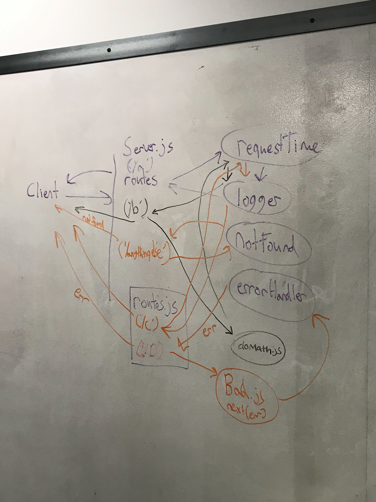

## Lab 07 - Middleware
### Author: Chris Kozlowski and Bonnie Wang

### Links and Resources
* [Submission PR](https://github.com/401-advanced-javascript-cdk/lab07-middleware/pull/1)
* [Travis](https://travis-ci.com/401-advanced-javascript-cdk/lab07-middleware)

### Modules
#### `server.js`
##### Routes
`app.get('/a')` `app.get('./b')`

#### `./lib/route.js`
`app.get('/c')` `app.get('./d')`

### Middleware Modules
`doMath.js` `error-handling.js` `logger.js` `notFound.js` `requestTime.js`

### Instructions
* Pull git repository
* Run `nodemon` from the root directory.  Server will spin up on port 8080 by default.
* From a new terminal with httpie or a RESTful app like Postman, routes can be hit to show examples of different request handling middleware.

### Testing
* `npm test`

